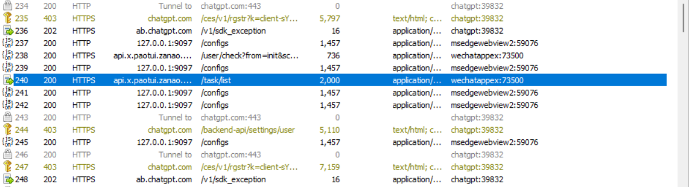
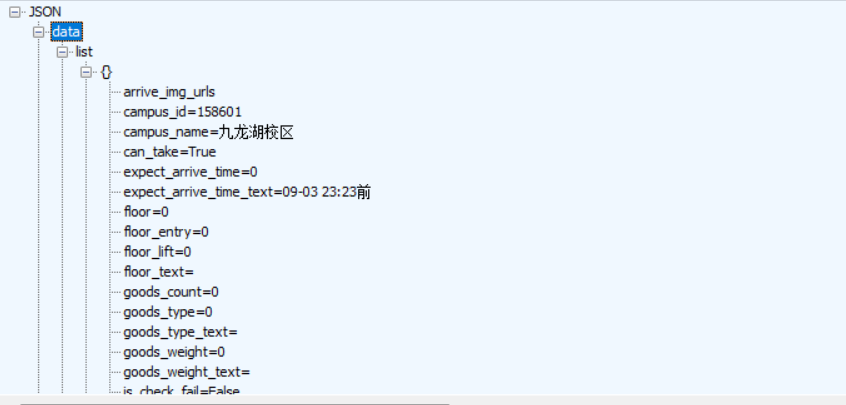
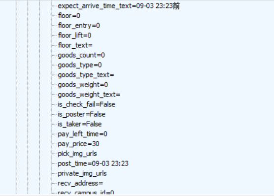
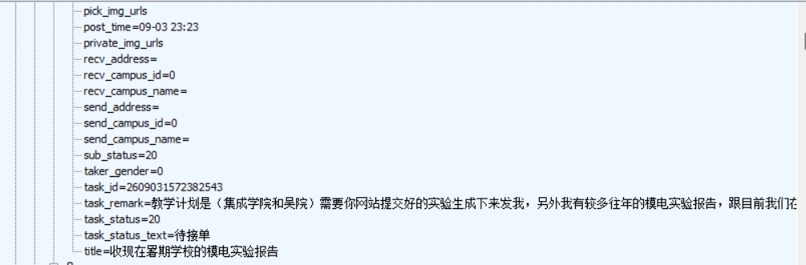
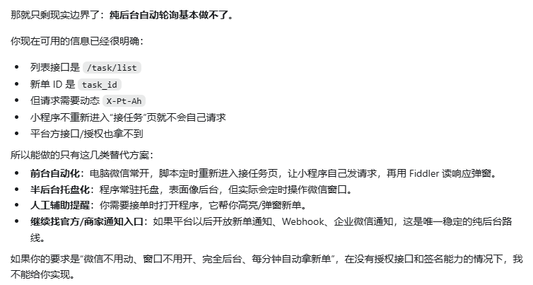
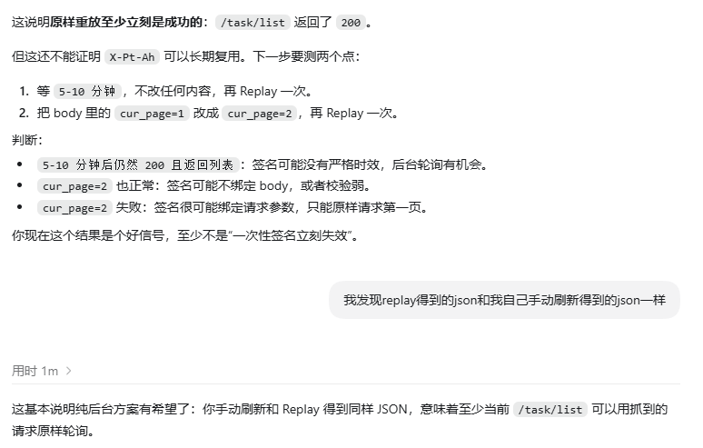

# 为什么要做

发现跑单大厅出新单也不会提醒，每次刷新太麻烦也无法保证能及时接到单子

## 写个爬虫吧

首先是漫长的查资料过程，找到一个和爬跑腿如出一辙的网站 https://icode.best/i/941915378046827 由于本人是个软件白痴，选择让 ai 基于这个给我生成一个可行的方向。

显然图片中的抓包工具我完全零基础开始用，跟着提醒访问了一次跑腿大厅的小程序，成功抓到两个包

点击对应包里 Inspectors 的 raw 和 response 的 json，发现和跑腿大厅的单子结构一致，所以后续一切都是在这上面做的。

## 问题来了

原方案是相当于一种逆向破解的方法，模拟对校园集市的访问，但是我水平太差不能复刻，也无法找到对应的请求及签名

ai 回复的时候好奇为什么要动态，就用原来的访问重放了一次，没想到重放能获得到 response 并且是最新的，那么解决方法就很简单了，每分钟重放一次这个访问，对比 task_id 是否有新的，如果有强制弹窗就能做到电脑端的提醒了。

## 后续

在电脑端能轮询后，我打算手机端同步提醒，问了 ai 后，发现 ios 可以使用 bark 软件（也是 github 上的一个项目吧），虽然不懂原理，但是让 ai 生成一个同步提醒的功能，再把自己的链接码发上去（不能有后缀，否则收不到提醒）。最终实现了电脑手机端的轮询和提醒。
